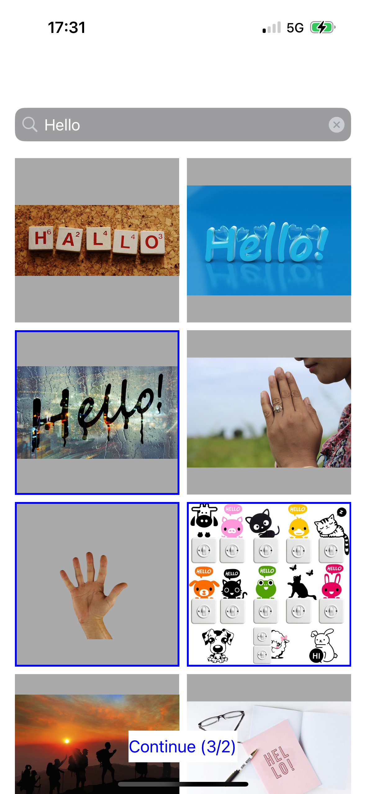

# AutoEditing

AutoEditing is an iOS application that allows users to search and select images from Pixabay, then view them in a carousel animation.

    
    

## Features

- ✅ Search images using Pixabay's API
- ✅ Select images from search results (min. 2 to animate)
- ✅ View selected images in an animated carousel
- ✅ Infinite scroll pagination for search results
- ✅ Image caching for better performance

## Requirements

- iOS 15.0+
- Xcode 14.0+
- Swift 5.0+
- SnapKit 5.7.1+
- Pixabay API Key

## Installation

1. Clone the repository
2. Install dependencies using Swift Package Manager (SPM)
   - SnapKit will be automatically installed when building the project
3. Set up your Pixabay API Key:
   - Open Xcode
   - Go to Product > Scheme > Edit Scheme
   - Select "Run" from the left sidebar
   - Go to "Arguments" tab
   - Under "Environment Variables", add:
     - Name: `PIXABAY_API_KEY`
     - Value: Your Pixabay API key

## Architecture

The project follows the MVC (Model-View-Controller) pattern with a Coordinator for navigation:

- **Models**: Simple data structures like `Image`
- **Views**: UI components using UIKit with SnapKit for layout
- **Controllers**: Business logic and view management
- **Services**: Network and data source implementations
- **Coordinator**: Navigation flow management

## Testing

The project includes unit tests for:

- Network operations
- View Controllers
- URL Extensions
- Data Sources

Run tests using:

- Xcode's Test Navigator
- Command + U
- `xcodebuild test`

## Dependencies

- [SnapKit](https://github.com/SnapKit/SnapKit): A Swift DSL for Auto Layout

## Key Components

1. **SearchViewController**: Handles image search and selection
2. **CarouselViewController**: Displays selected images in an animated carousel
3. **PixabayDataSource**: Fetches images from Pixabay API
4. **Networker**: Manages network requests with caching
5. **Coordinator**: Handles navigation between screens

## What's next?

- Improve UI design
- Get hired as iOS Engineer ☝️

## License

This project is created by Louis Delmas.
